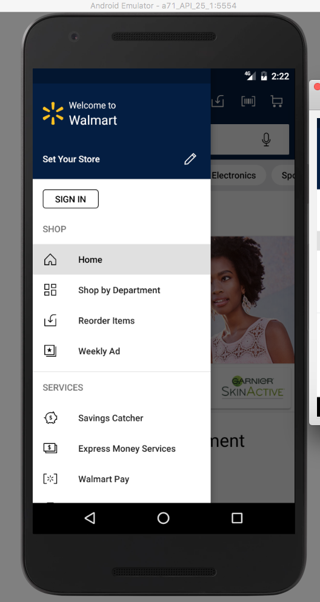
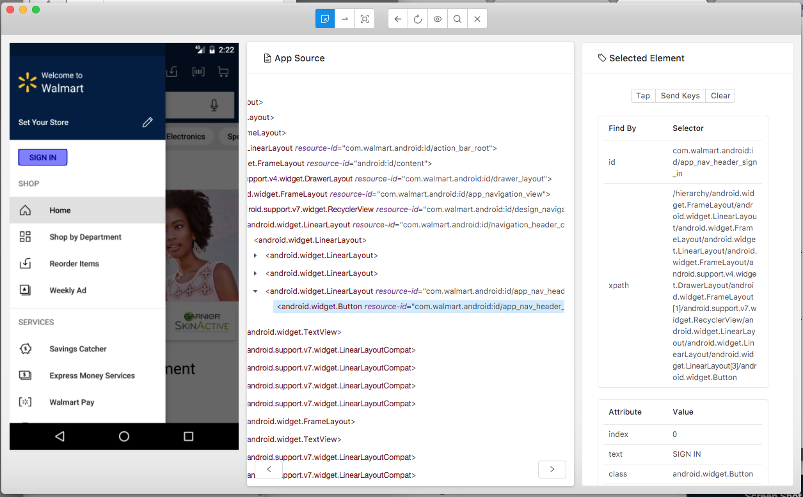

## Native Android app locators

- To find native Android app locators, there is a handy tool:
 **[Appium Desktop](https://github.com/appium/appium-desktop)**  
 - It's a GUI wrapper around the Appium server, comes with an Inspector, which enables you to check out the hierarchy of your app.

- E.g How to find the *SIGN IN* button in the following screen



  **Steps:**
   1. Open Appium Desktop, and start the server 
   2. Click **Start Inspector Session** button
   3. Add the Desired Capabilites property one by one. Or Add them from a .json data, e.g.
```bash
{
  "platformName": "Android",
  "platformVersion": "7.1.1",
  "deviceName": "a71_API_25",
  "app": "/Users/abc/app/Walmart.apk",
  "locationServicesAuthorized": true,
  "locationServicesEnabled": true
}
```
   4. Click **Start Session** to start the inspector
   5. Go to the Sign In screen, and select **SIGN IN** field in the inspector's left preview window.
 
   6. Check the element's attribute. E.g for this case, it has an unique id `"com.walmart.android:id/app_nav_header_sign_in"`, then we can use ** id** as the **locateStrategy** and ***com.walmart.android:id/app_nav_header_sign_in***, as the **selector**
   7. If the element does not have an unique value, you could locate element by relative **xpath**. e.g. *//android.widget.Button[@value="Password"]*
   8. Please note - should use ***accessibility id*** or ***id*** as much as possible.  ***xpath*** is slow and unreliable.

### Quiz
 - Please automate Verify Empty Cart test, steps:
   * Launch the Walmart Android app
   * Click 'Cart' icon in the top navigation bar
   * Verify you will see msg "You have no saved items right now" in Cart page
