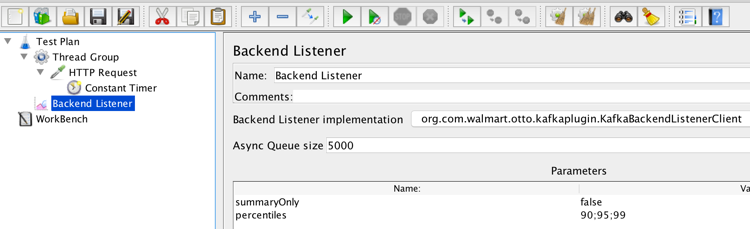
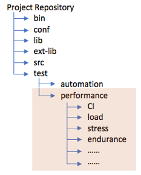
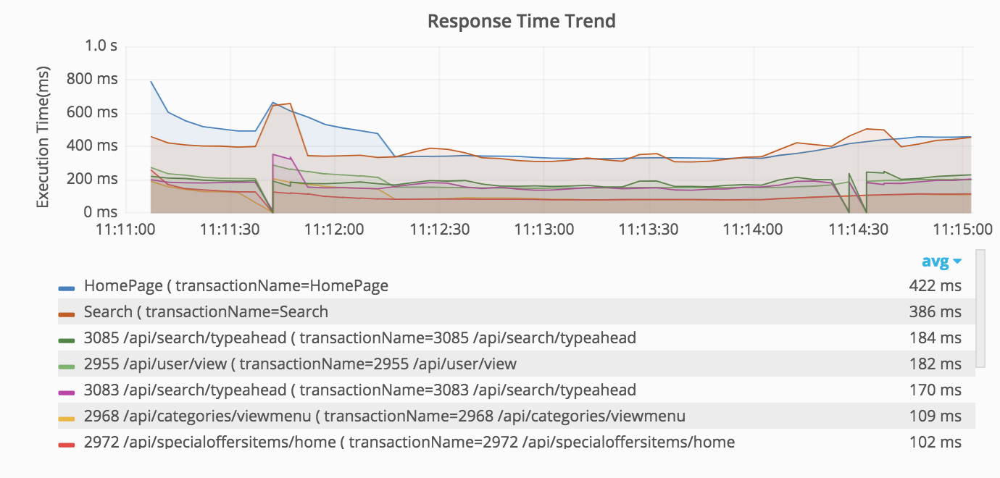
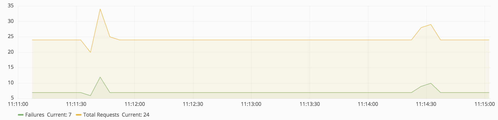
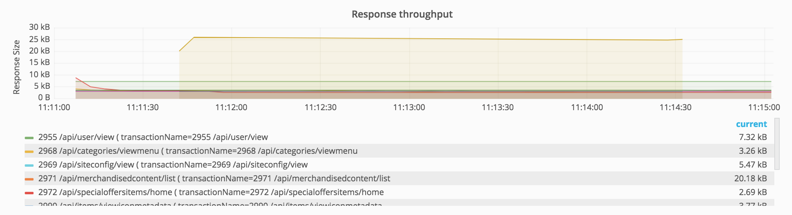
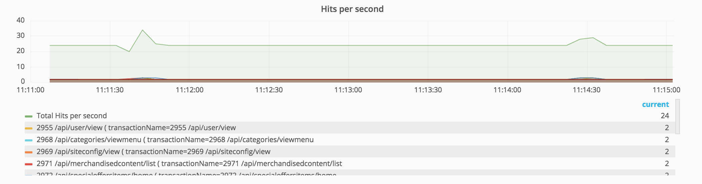

### **JMeter Test Plan creation steps**

1.	Download the customized version of jmeter from [getLatestVersionOfJmeter](http://gec-maven-nexus.walmart.com/content/repositories/pangaea_releases/otto/nextgen/nextgenjmeter/nextgenplatformjmeter/).
2.	Add the Thread Group where you can specify number of threads, rampup time and test duration.
3.	Add HTTP sampler request for every request and CSV data config element for test data set up
4.	Add Timers if you want to introduce think times between each transaction.
5.	Add KafkaBackendListener to stream all test results into the Data Insights module. This custom JMeter plugin is bundled into the custom JMeter downloaded in step 1 above. Follow these steps to add the Kafka Listener. 
a.	Click on testplan-->Add-->Listener-->Backend Listener.  
b.	Select kafkaplugin.KafkabackendListenerClient from the drop down list in Backend Listener Implementation. 
c.	Update summaryOnly parameter to false. 

6.	Save the JMX.  
7.	The test plan should not have other Listeners to generate reports like Aggregate Report, Summary Report. These listeners are resource intensive and can significantly impact the load generation capabilities for the test agent machine.  

### **Easy Onboarding Tips**
1. Before creating TestPlan on TestArmada.,ensure that user:<b>SVCgecfeops</b> is added to your GitHub project repo as Collaborators.  
2. Ensure that your tests and their artifacts are structured as shown below:

 
Do note that the folders are named as per type of performance test. If your project is onboarded on the self service portal, creating new tests is as simple as entering the folder name of your new test

### **Results Dashboard**
1. Response Time trend: This would give me average response time for all the transaction.  
  
2. Comparison of percentage distribution of successful transaction v/s failed transactions."ok" represents successful and "ko" represents failed.  
  
3. Transaction Rate: Trend rate comparison between successful and failed transaction.  
  
4. Response Throughput: Trend of network throughput for various transaction.  
  
5. Hits/sec or Transaction/sec(TPS):Trend of transactions per sec for various transactions.  

