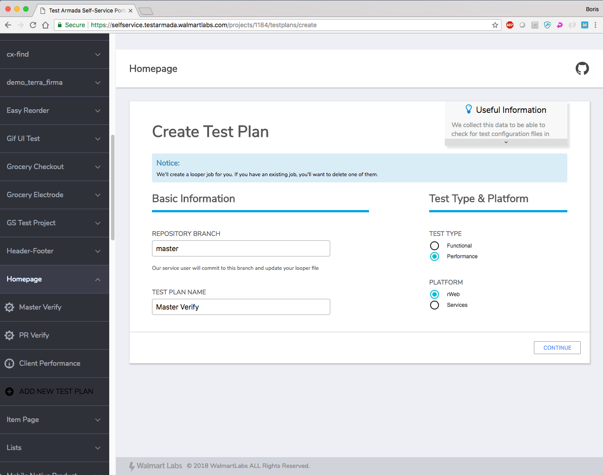
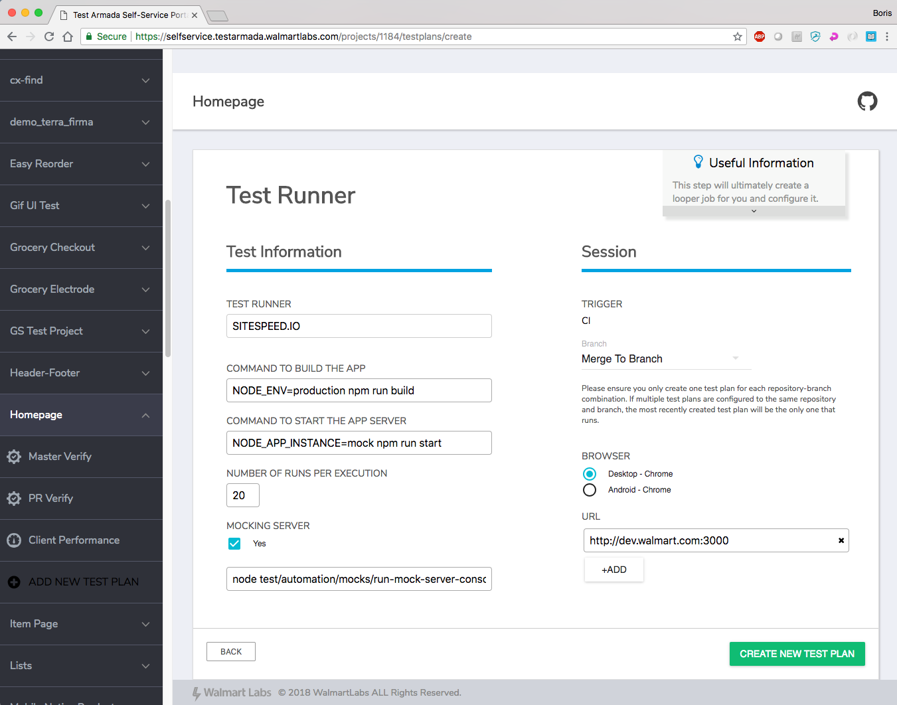
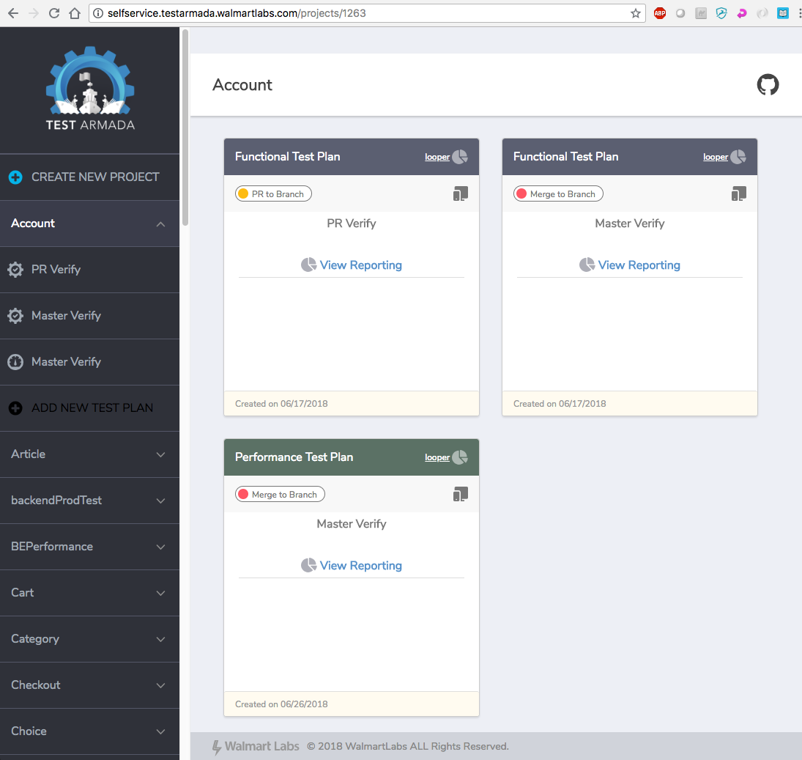
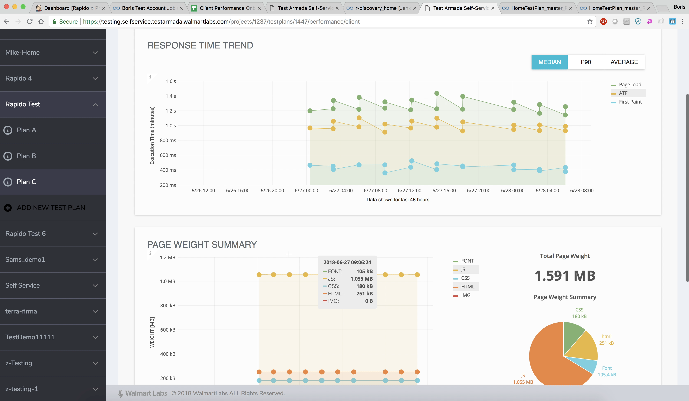

# Introduction

Our side performance measurement tool that is based on Sitespeed and is currently serving Web and mWeb interfaces.

## Test Plan creation

First you need to fill in Repository Branch and a name for your Test Plan. Fill in Test Type and Platform. For client performance Sitespeed test, please select rWeb.

Next, fill in App Build command, App Server start command, number of runs and optionally Mocking Server start command. Currenly, only CI triggers are supported and you have a choice between PR to Branch (tests are run when a PR to merge into your Branch is opened) and Merge to Branch (tests are run on any commit to your Branch). 

You can now see the newly created Performance Test Plan on the project dashboard. Here you have a link to a Looper job associated with this test plan as well as Gighub link for your project on the top bar accross from project name. Click on View Reporting to view test results.

## Test results

Each test run will result in a new set pf datapoints on the results page and a new SiteSpeed report in the bottom section of the report. You will be able to see how particular metric changes between test runs.

