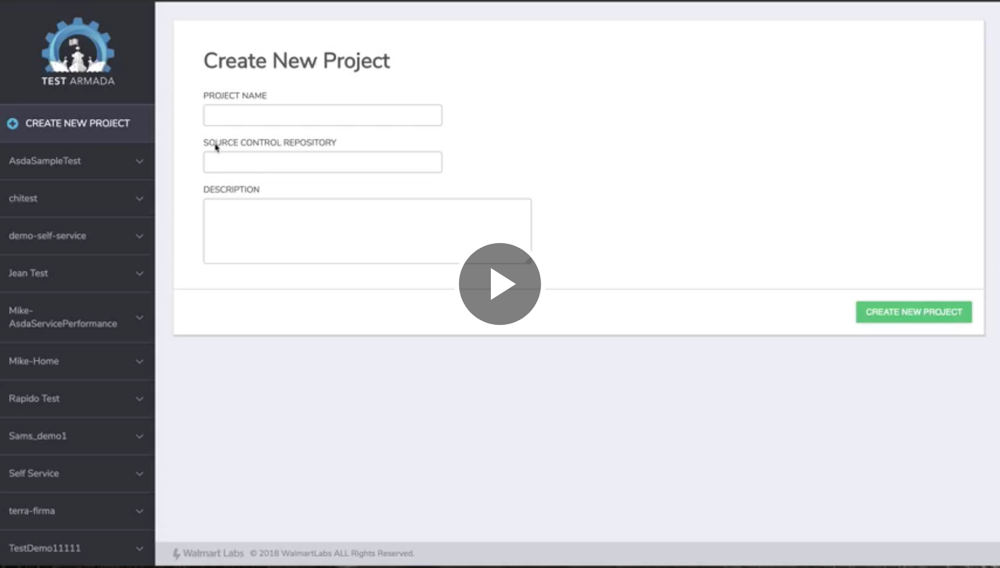
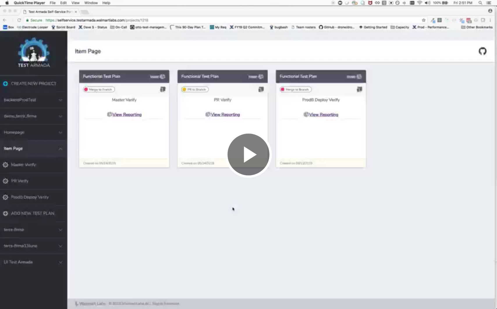

## Introduction

The Self-Service Portal (S.S. Portal) is a UI tool enabling developers to setup and execute functional, frontend and backend performance test projects with a few clicks. The tool also provides data insights offering real-time and trending reports giving you the power to troubleshoot and debug issues on demand and monitor the health of your test suite.

Check out a short demo video of our tool:

* S.S. Portal Functional Test Setup Walkthrough

  

* S.S. Portal Data Insights Walkthrough

  

### S.S. Portal On-boarding Instructions

On-boarding to the new platform could not be easier.

* For Existing Customers on Test Armada and Looper: DXT will migrate your project data and created a PR with simple configuration change to your existing Looper yml file. So, to take advantage of the new self-service portal, you simply need to review and merge the PR.

  > **Please note**: You will continue to have access for existing Admiral portal along with S. S. Portal in parallel.

* For New Customers or Customer that have an existing Looper Job: Due to popular demand, we are monitoring access to the portal in Q2. If you are interested in taking the UI for a test drive, please contact us at
  * Slack Channel: #testautomation 
  * File a ticket at our [service desk](https://jira.walmart.com/servicedesk/customer/portal/1422) and someone will respond to your request

### Support

With any new release, we know there will be a few bumps. However, we are here to support you with any issue or problem you make encounter. Below are a few resources to help with your on-boarding process:

Self-Service Help

* S.S. Portal [Getting Started Guide](./SS%20Portal%20Getting%20Started)
* [Documentation](/Functional%20Testing/) outlining TDK usage, API references, training, and FAQs

On-Call Support

* Please find our on-call support information on the [contact](http://testarmada.walmartlabs.com/contact) page.

In addition, we will be hosting office open hours between 11 am-Noon on the following days to help address any questions you have in real-time:

* Thursday, June 21st, 2018
* Thursday, June 28th, 2018
* Thursday, July 5th, 2018
* Thursday, July 12th, 2018

[Here](https://walmart.zoom.us/j/279803456) is link to Zoom conference call for above office hours meeting series.
